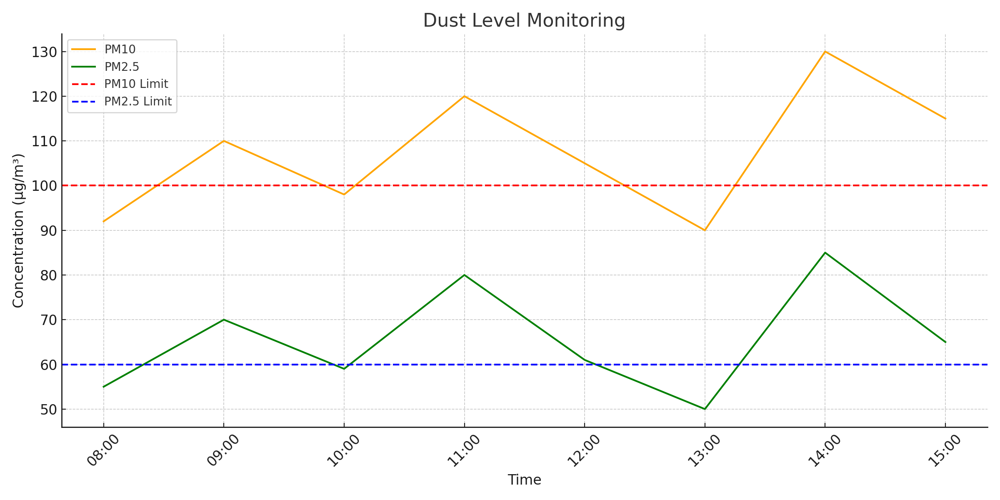

# Dust Monitoring & Control System

### 🛠 Objective:
To study dust levels in mining zones and suggest control strategies for safer, compliant, and sustainable operations.

### 📌 Features:
- Analyzes PM10/PM2.5 data from CSV using CPCB safety limits
- Flags high-risk periods and recommends dust control actions
- Generates trend graph of pollution levels for reporting

### 💻 Technologies Used:
- Python 🐍
- Pandas 📊
- Matplotlib 📈

### 📸 Output Sample:

### 📂 How to Run:
1. Place your `dust_data.csv` file in the same folder
2. Run `dust_monitor.py` using any Python IDE or terminal
3. Output graph will be saved as `dust_sample_output.png`
